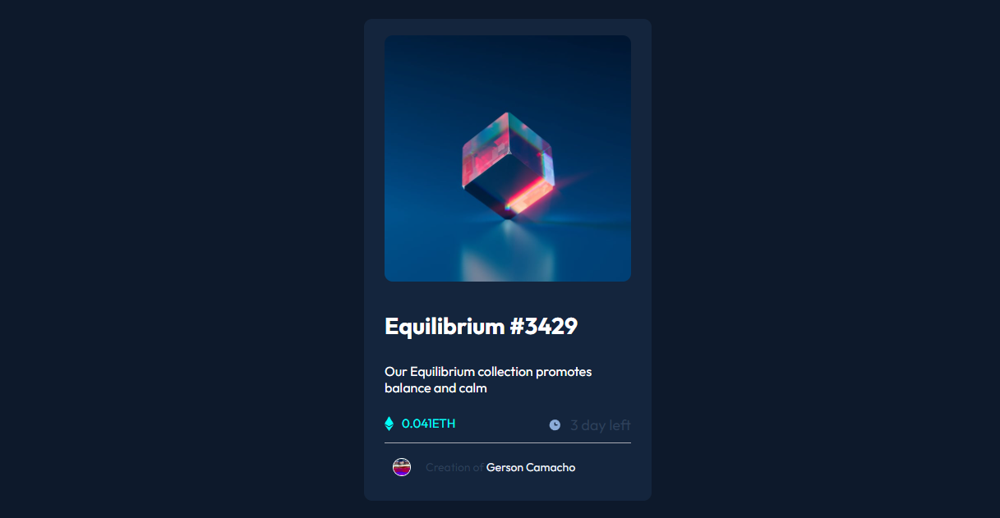

# Make It Real - NFT-PREVIEW-CARD

This is a solution to the NFT-PREVIEW-CARD project from the Make It Real course.

## Table of Contents

- [Summary](#summary)
  - [The Challenge](#the-challenge)
  - [Screenshot](#screenshot)
- [My Process](#my-process)
  - [Built With](#built-with)
  - [What I Learned](#what-i-learned)
  - [Continued Development](#continued-development)
  - [Useful Resources](#useful-resources)
- [Author](#author)
- [Acknowledgments](#acknowledgments)


## Summary

### The Challenge

Users should be able to:

- View an NFT card according to the challenge instructions.
- It should be configured first for mobile devices.

### Screenshot



## My Process

### Built With

- Semantic HTML5 markup.
- Custom CSS properties.
- Flexbox
- Mobile-first workflow
- React Component Development

### What I Learned

During the development of this project, I have gained valuable knowledge in creating components in React. I learned how to design and build reusable components, which improves the modularity and maintainability of the code. Additionally, I mastered passing parameters to components, allowing each to receive specific data and adapt to different contexts.

I also understood how functions in React can return components, facilitating the composition and organization of the user interface efficiently. These concepts have been fundamental in structuring and enhancing the functionality of my project. Below is the code for the main component `NftPreviewCard`. This component includes other components such as `Imagen`, `Descripcion`, `InformacionVentas`, and `PerfilCreador` to structure the NFT preview card:

```jsx
function NftPreviewCard() {
  return (
    <section className='nftPreviewCard'>
      <Imagen ruta='image-equilibrium.jpg' />
      <Descripcion
        nombre='Equilibrium '
        identificador=' #3429'
        descripcion='Our Equilibrium collection promotes balance and calm'
      />
      <InformacionVentas
        moneda='ETH'
        monto='0.041'
        tiempo='3 day left'
      />
      <PerfilCreador
        imagen='https://unavatar.io/kikobeats'
        nombreCreador=' Gerson Camacho '
        enlacePerfil='https://github.com/GersonSmithKevin'
      />
    </section>
  );
}
export default NftPreviewCard;
```
### Continued Development

In the future, I will focus on learning how to make my components responsive so that they adapt to different screen sizes. Since I have multiple CSS files for each subcomponent, I would like to learn techniques to handle responsive design more efficiently and avoid having to modify each CSS file individually. This will allow me to create applications that work well on devices of all sizes and improve the user experience.

### Useful Resources

- [CSS Documentation](https://developer.mozilla.org/en-US/docs/Web/CSS) - This documentation has been very helpful for understanding CSS properties and techniques. It has helped me resolve issues and improve the design of my projects.
- [React Documentation](https://react.dev/learn) - The React documentation has been key to understanding how components work and how to manage state and props. I recommend this resource to anyone learning React and looking to deepen their knowledge of building applications with this library.

## Author

- Website - [Gerson Camacho](https://github.com/GersonSmithKevin)

## Acknowledgments

I want to thank my classmates and teachers for their support and patience in addressing my questions and doubts during this project. Their help and guidance have been crucial to my learning and development. Thank you for sharing your knowledge and experience!
